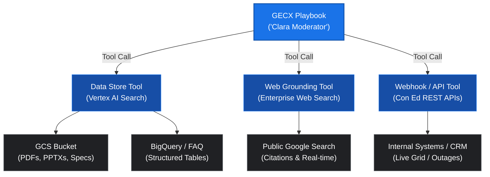

# Con Edison Tech Day 2026: AI in Action Panel Moderator ("Clara")

An interactive, holographic 3D AI Moderator application designed for the **Con Edison Tech Day: "AI in Action at Con Edison"** keynote and panel showcase.

The AI moderator, **Clara** (Candidate B persona: smart, youthful tech lead in Con Edison tech wear with glasses), guides the audience through the partnership between Con Edison Business and Enterprise Technology Solutions (ETS) across five core AI use cases.

---

## 🚀 Key Features

1. **3D Photo-Realistic Avatar (Candidate B - "Clara")**:
   - WebGL 3D avatar rendered via Three.js with studio 3-point lighting and electric blue rim illumination.
   - Real-time procedural lip-sync: Web Audio API FFT frequency analysis maps speech cadence to ARKit/Oculus visemes (`viseme_aa`, `viseme_O`, `viseme_E`, `viseme_I`, `viseme_SS`).
   - Procedural life simulation: natural eye blinking cycles and sinusoidal breathing motion.

2. **Google Cloud Text-to-Speech (Journey-F Voice)**:
   - Powered by Google Cloud's `en-US-Journey-F` ultra-realistic conversational female voice model.
   - Articulate, cheerful, youthful, and strictly professional (zero slang).
   - In-memory MD5 caching on the Express backend provides instantaneous (<100ms) speech playback.

3. **Dual Conversational Intelligence Backends**:
   - **Mode A (Gemini Direct)**: Built for rapid prototyping and low-latency stage banter via Gemini 3.6 Flash.
   - **Mode B (GECX / Dialogflow CX Enterprise)**: Connects Clara directly to Google Enterprise Customer Experience (GECX) Playbooks, Vertex AI Search grounding, and session state machines.

4. **Con Edison Panel Agenda & Dynamic Lower-Thirds**:
   - **`00 INTRO`**: Keynote Welcome & Opening Remarks (Clara)
   - **`01 BILLING`**: Customer Operations & Generative Billing Agent (Patrick Hooper)
   - **`02 IDLING`**: Fleet Vehicle Idling Reduction AI (Fleet Modernization Team)
   - **`03 MANHOLE`**: Subsurface Manhole Safety & Acoustic Sensing (Subsurface Engineering Team)
   - **`04 WEATHER`**: Severe Weather Modeling & Grid Resilience (Tom Langlois)
   - **`05 CLEAN HEAT`**: Customer Energy Solutions & Clean Heat AI (Clean Energy Solutions Team)
   - **`06 Q&A`**: Interactive Audience & Panel Q&A (Clara powered by Gemini or GECX)

5. **Presenter Stage HUD & Hotkeys**:
   - **`Spacebar`**: Toggle Play / Pause speech.
   - **`→` (Right Arrow)**: Advance to next topic.
   - **`←` (Left Arrow)**: Return to previous topic.
   - **`M`**: Toggle live microphone for audience voice Q&A (Web Speech API).
   - **`F` / Stage Mode**: Fullscreen clean broadcast view for stage projectors or giant LED walls.
   - **URL Direct Hash**: Jump or bookmark any use case directly (e.g., `#billing`, `#weather`, `#manhole`).

---

## 🏛️ Architecture: Gemini Direct vs. GECX Enterprise

```
               ┌────────────────────────────────────────────────────────┐
               │          FRONTEND: 3D HOLOGRAPHIC AVATAR STAGE         │
               │  - Candidate B ("Clara") WebGL / Three.js Engine       │
               │  - Audio FFT Analyser -> ARKit Morph Viseme Lip-Sync   │
               │  - Stage HUD, Topic Tracker, Dynamic Lower-Thirds       │
               └───────────────────────────┬────────────────────────────┘
                                           │ Spoken / Text Input (Q&A)
                                           ▼
               ┌────────────────────────────────────────────────────────┐
               │               TIER 2: EXPRESS BACKEND (Cloud Run)      │
               │  - /api/agenda : 5 Con Edison Use Cases & Speaker Bios │
               │  - /api/tts    : Google Cloud TTS (en-US-Journey-F)    │
               │  - /api/chat   : Conversational Routing                │
               └───────────────┬────────────────────────┬───────────────┘
                               │                        │
         [Mode A: Gemini Direct]│                        │   [Mode B: GECX Enterprise]
                               ▼                        ▼
               ┌────────────────────────┐      ┌─────────────────────────────────┐
               │   Direct Gemini API    │      │         GECX BACKEND            │
               │   (gemini-3.6-flash)   │      │  (Dialogflow CX / Vertex Agents)│
               │  - Fast Q&A prototyping│      │  - Multi-turn Playbooks         │
               │  - server.js           │      │  - Grounded Vertex AI Search    │
               └────────────────────────┘      │  - Enterprise Security & Tools  │
                                               │  - server_gecx.js & gecx_service│
                                               └─────────────────────────────────┘
```

### Why GECX for Con Edison Enterprise?
* **Enterprise Grounding**: GECX connects natively to Vertex AI Search data stores containing Con Edison internal documentation, operating procedures, and technical specifications.
* **Stage Automation via Tools**: GECX Playbooks can emit custom payloads (e.g. `{ action: 'SHOW_LOWER_THIRD', speaker: 'Tom Langlois' }`) enabling conversational triggers to steer slides and stage lighting directly.
* **Direct Tie to Featured Use Case #1**: Patrick Hooper's Generative Billing Agent is itself built on GECX, establishing a unified architectural showcase.

---

## How Knowledge Repositories Work in GECX

In GECX (Google Enterprise Customer Experience / Dialogflow CX), conversational agents ground their responses through **Playbook Tools**. Rather than querying public search indiscriminately, GECX Playbooks orchestrate specialized tool connectors based on the user's intent:

```
                              ┌──────────────────────────────────────────────┐
                              │     GECX Playbook ("Clara Moderator")        │
                              └──────────────────────┬───────────────────────┘
                                                     │ Tool Call
                      ┌──────────────────────────────┼──────────────────────────────┐
                      ▼                              ▼                              ▼
          [Data Store Tool]                  [Web Grounding Tool]          [Webhook / API Tool]
         (Vertex AI Search)                 (Enterprise Web Search)          (Con Ed REST APIs)
                  │                                  │                              │
         ┌────────┴────────┐                         │                              │
         ▼                 ▼                         ▼                              ▼
    GCS Bucket        BigQuery / FAQ           Public Google Search        Internal System / CRM
 (PDFs, PPTXs, Specs) (Structured Tables)     (Citations & Real-time)      (Live Grid / Outages)
```



### Knowledge Grounding Capabilities:

1. **Vertex AI Search Data Store (Private Enterprise Repository)**:
   - Connects to private Google Cloud Storage (GCS) buckets containing Con Edison technical documentation, slide decks, talk tracks, and speaker bios.
   - Extracts semantic embeddings and provides grounded citations with verifiable page numbers.
   - Eliminates hallucination by constraining Clara's generative answers to official utility material.

2. **Web Grounding Tool (Curated & Public Search)**:
   - Connects to Google Search Grounding to pull real-time external facts, energy market updates, or regulatory rulings with web source links.
   - Can also be constrained to authorized enterprise domains (e.g. `coned.com`, `nyiso.com`).

3. **Webhook / API Tools (Dynamic System Integration)**:
   - Directly executes REST or gRPC calls to internal Con Edison APIs (e.g. OMS/outage management, billing calculation engines, or fleet telemetry) to retrieve live runtime state.

---

## 📂 Repository Structure

```
├── avatar_stage.js          # Three.js 3D avatar engine, lighting, visemes & procedural life
├── stage_controller.js      # Presentation state machine, Google Cloud TTS audio & hotkeys
├── index.html               # Main holographic stage broadcast interface
├── styles.css               # Con Edison glassmorphism HUD, lower-thirds & stage animations
├── server.js                # Mode A: Express backend with Gemini Direct integration
├── server_gecx.js           # Mode B: Express backend with native GECX integration
├── gecx_service.js          # GECX SDK client, session path builder & payload parser
├── test/
│   └── test_gecx.js         # Comprehensive GECX test suite (8 tests)
├── package.json             # Node.js dependencies (@google-cloud/dialogflow-cx, etc.)
├── Dockerfile               # Production container definition for Cloud Run
├── public/
│   ├── agenda.json          # Master talk tracks, use case metadata, speaker bios
│   └── assets/avatars/
│       ├── brunette.glb     # Selected Candidate B avatar (4.6 MB)
│       └── avaturn.glb      # Alternate candidate avatar
└── lib/
    └── three.min.js         # Three.js core library
```

---

## 🛠️ Local Development & Running

### Prerequisites
- Node.js 18+
- Google Cloud authentication (`gcloud auth application-default login`)

### 1. Run with Direct Gemini (Default)
```bash
npm install
npm start
# Server starts on http://localhost:8080 using server.js
```

### 2. Run with Native GECX Backend
```bash
# Optional environment overrides (defaults to pradeep-demo-1 / us-central1)
export GCP_PROJECT_ID="pradeep-demo-1"
export GECX_LOCATION="us-central1"
export GECX_AGENT_ID="668bd4db-b76d-4f1b-be6b-8e290bb741bd"

npm run start:gecx
# Server starts on http://localhost:8080 using server_gecx.js
```

### 3. Verify Connected GECX Agent Info
When running in GECX mode, you can inspect the connected agent metadata via:
```bash
curl http://localhost:8080/api/gecx/agent
```

---

## 🧪 Testing & Validation

The repository includes a dedicated test suite validating GECX service initialization, regional endpoints, canonical session path construction, response parsing, and live connectivity to Google Cloud:

```bash
npm test
```

### Test Suite Coverage (9 Tests):
1. `GECXService initializes with default project and location`
2. `GECXService properly formats regional API endpoints (global, us-central1, us-east1)`
3. `formatSessionPath generates canonical CX resource string`
4. `formatSessionPath supports environment qualification (draft, prod)`
5. `detectIntent rejects invalid or empty utterances`
6. `parseResponse extracts and sanitizes spoken text messages`
7. `parseResponse extracts custom stage actions and metadata payloads`
8. `Live Con Edison Moderator Agent (pradeep-demo-1 / 668bd4db-b76d-4f1b-be6b-8e290bb741bd)`
9. `Live Panel Topic Query: Patrick Hooper & Billing Agent`

---

## ☁️ Cloud Run Deployment

To deploy either backend to Google Cloud Run:

```bash
# Deploy Mode A (Gemini Direct)
gcloud run deploy coned-tech-day \
  --source . \
  --region us-central1 \
  --allow-unauthenticated \
  --project pradeep-demo-1 \
  --memory 1Gi \
  --cpu 1

# Or deploy Mode B (GECX Enterprise)
gcloud run deploy coned-tech-day-gecx \
  --source . \
  --region us-central1 \
  --allow-unauthenticated \
  --project pradeep-demo-1 \
  --set-env-vars DEFAULT_SERVER=server_gecx.js,GECX_LOCATION=us-central1,GECX_AGENT_ID=668bd4db-b76d-4f1b-be6b-8e290bb741bd \
  --memory 1Gi \
  --cpu 1
```

---

## 📄 License
Internal Con Edison Demonstration — Enterprise AI & Technology Solutions (ETS).
