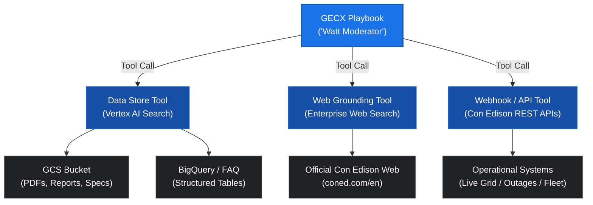

# Con Edison Tech Day 2026: AI in Action Panel Moderator ("Watt")

An interactive, holographic 3D AI Moderator application designed for the **Con Edison Tech Day: "AI in Action at Con Edison"** keynote and panel showcase.

The AI moderator, **Watt** (Candidate B persona: smart, youthful tech lead in Con Edison tech wear with glasses), guides the audience through the partnership between Con Edison Business and Enterprise Technology Solutions (ETS) across five core AI use cases.

---

## 🚀 Key Features

1. **3D Photo-Realistic Avatar (Candidate B - "Watt")**:
   - WebGL 3D avatar rendered via Three.js with studio 3-point lighting and electric blue rim illumination.
   - Real-time procedural lip-sync: Web Audio API FFT frequency analysis maps speech cadence to ARKit/Oculus visemes (`viseme_aa`, `viseme_O`, `viseme_E`, `viseme_I`, `viseme_SS`).
   - Procedural life simulation: natural eye blinking cycles and sinusoidal breathing motion.

2. **Google Cloud Text-to-Speech (Journey-F Voice)**:
   - Powered by Google Cloud's `en-US-Journey-F` ultra-realistic conversational female voice model.
   - Articulate, cheerful, youthful, and strictly professional (zero slang) with a calibrated stage pacing rate (0.88x).
   - In-memory MD5 caching on the Express backend provides instantaneous (<25ms) speech playback.

3. **Exclusive GECX Playbook Intelligence**:
   - All conversations and stage Q&A route directly to **Google Enterprise Customer Experience (GECX)** / Dialogflow CX Playbooks (`projects/[project]/locations/us-central1/agents/668bd4db-b76d-4f1b-be6b-8e290bb741bd`).
   - Grounded in playbook goals, instructions, session management, and extensible tools.
   - UI features a highlighted, luminous GECX Playbook status badge with an active pulsing cyan LED.

4. **Con Edison Panel Agenda & Use Cases**:
   - **`00 INTRO`**: Keynote Welcome & Opening Remarks (Watt)
   - **`01 BILLING`**: Customer Operations & Generative Billing Agent (Customer Operations Team)
   - **`02 IDLING`**: Fleet Vehicle Idling Reduction AI (Fleet Modernization Team)
   - **`03 MANHOLE`**: Subsurface Manhole Safety & Acoustic Sensing (Subsurface Engineering Team)
   - **`04 WEATHER`**: Severe Weather Modeling & Grid Resilience (Electric Operations & Meteorology Team)
   - **`05 CLEAN HEAT`**: Customer Energy Solutions & Clean Heat AI (Clean Energy Solutions Team)
   - **`06 Q&A`**: Interactive Audience & Panel Q&A (Watt powered by GECX Playbook)

5. **Presenter Stage HUD & Hotkeys**:
   - **`Spacebar`**: Toggle Play / Pause speech.
   - **`→` (Right Arrow)**: Advance to next topic.
   - **`←` (Left Arrow)**: Return to previous topic.
   - **`M`**: Toggle live microphone for audience voice Q&A (Web Speech API).
   - **`F` / Stage Mode**: Fullscreen clean broadcast view for stage projectors or giant LED walls.
   - **URL Direct Hash**: Jump or bookmark any use case directly (e.g., `#billing`, `#weather`, `#manhole`).

---

## 🏛️ Architecture: GECX Enterprise Integration

```
               ┌────────────────────────────────────────────────────────┐
               │          FRONTEND: 3D HOLOGRAPHIC AVATAR STAGE         │
               │  - Candidate B ("Watt") WebGL / Three.js Engine        │
               │  - Audio FFT Analyser -> ARKit Morph Viseme Lip-Sync   │
               │  - Stage HUD, Highlighted GECX Indicator & Lower-Thirds│
               └───────────────────────────┬────────────────────────────┘
                                           │ Spoken / Text Input (Q&A)
                                           ▼
               ┌────────────────────────────────────────────────────────┐
               │               TIER 2: EXPRESS BACKEND (Cloud Run)      │
               │  - /api/agenda : 5 Con Edison Use Cases & Descriptions │
               │  - /api/tts    : Google Cloud TTS (en-US-Journey-F)    │
               │  - /api/chat   : GECX Dialogflow CX Sessions Router    │
               └───────────────────────────┬────────────────────────────┘
                                           │
                                           │ [GECX Enterprise Routing]
                                           ▼
               ┌────────────────────────────────────────────────────────┐
               │                      GECX BACKEND                      │
               │            (Dialogflow CX / Vertex AI Agents)          │
               │  - Watt - Tech Day Moderator Playbook                  │
               │  - Session Management & Intent Resolution              │
               │  - Grounded Vertex AI Search Data Stores               │
               │  - Enterprise OpenAPI & Webhook Tools                  │
               └────────────────────────────────────────────────────────┘
```

### Why GECX for Con Edison Enterprise?
* **Enterprise Grounding**: GECX connects natively to Vertex AI Search data stores containing Con Edison internal documentation, operating procedures, and technical specifications.
* **Stage Automation via Tools**: GECX Playbooks can emit custom payloads enabling conversational triggers to steer slides and stage lighting directly.
* **Direct Tie to Featured Use Case #1**: The Customer Operations Generative Billing Agent is itself built on GECX, establishing a unified architectural showcase.

---

## 🔍 How Knowledge Repositories Work in GECX

In GECX (Google Enterprise Customer Experience / Dialogflow CX), conversational agents ground their responses through **Playbook Tools**. Rather than querying public search indiscriminately, GECX Playbooks orchestrate specialized tool connectors based on the user's intent:



### Knowledge Grounding Capabilities:

1. **Vertex AI Search Data Store (Private Enterprise Repository)**:
   - Connects to private Google Cloud Storage (GCS) buckets containing Con Edison technical documentation, slide decks, talk tracks, and program guides.
   - Extracts semantic embeddings and provides grounded citations with verifiable references.
   - Eliminates hallucination by constraining Watt's generative answers to official utility material.

2. **Web Grounding Tool (Curated Domain Search)**:
   - Connects to authorized enterprise domains (e.g. `coned.com/en`) to pull real-time external facts, energy market updates, or regulatory filings with web source links.

3. **Webhook / API Tools (Dynamic System Integration)**:
   - Directly executes REST calls to operational telemetry endpoints (e.g. OMS/outage status, grid load MW, acoustic sensor health, or fleet telematics) to retrieve live runtime state.

---

## 📂 Repository Structure

```
├── avatar_stage.js          # Three.js 3D avatar engine, lighting, visemes & procedural life
├── stage_controller.js      # Presentation state machine, Google Cloud TTS audio & hotkeys
├── index.html               # Main holographic stage broadcast interface
├── styles.css               # Con Edison glassmorphism HUD, lower-thirds & stage animations
├── server.js                # Express backend with native GECX Dialogflow CX integration
├── gecx_service.js          # GECX SDK client, session path builder & payload parser
├── test/
│   └── test_gecx.js         # Comprehensive GECX test suite (8 tests)
├── package.json             # Node.js dependencies (@google-cloud/dialogflow-cx, etc.)
├── Dockerfile               # Production container definition for Cloud Run
├── public/
│   ├── agenda.json          # Master talk tracks, use case metadata, topic descriptions
│   └── assets/avatars/
│       ├── brunette.glb     # Selected Candidate B avatar (4.6 MB)
│       └── avaturn.glb      # Alternate candidate avatar
└── lib/
    └── three.min.js         # Three.js core library
```

---

## 🛠️ Local Development & Running

### Prerequisites
- Node.js 18+
- Google Cloud authentication (`gcloud auth application-default login`)

### 1. Run with GECX Backend
```bash
npm install

# Optional environment overrides
export GCP_PROJECT_ID="{project_name}"
export GECX_LOCATION="us-central1"
export GECX_AGENT_ID="{GECX_AGENT_ID}"

npm start
# Server starts on http://localhost:8080 using server.js with GECX integration
```

### 2. Verify Connected GECX Agent Info
When running, you can inspect the connected agent metadata via:
```bash
curl http://localhost:8080/api/gecx/agent
```

---

## 🧪 Testing & Validation

The repository includes a dedicated test suite validating GECX service initialization, regional endpoints, canonical session path construction, response parsing, and live connectivity to Google Cloud:

```bash
npm test
```

### Test Suite Coverage:
1. `GECXService initializes with default project and location`
2. `GECXService properly formats regional API endpoints (global, us-central1, us-east1)`
3. `formatSessionPath generates canonical CX resource string`
4. `formatSessionPath supports environment qualification (draft, prod)`
5. `detectIntent rejects invalid or empty utterances`
6. `parseResponse extracts and sanitizes spoken text messages`
7. `parseResponse extracts custom stage actions and metadata payloads`
8. `Live Con Edison Moderator Agent connectivity and intent resolution`
9. `Live Panel Topic Query resolution via GECX Playbook`

---

## ☁️ Cloud Run Deployment

To deploy the service to Google Cloud Run:

```bash
gcloud run deploy coned-tech-day \
  --source . \
  --region us-central1 \
  --allow-unauthenticated \
  --project {GCP_PROJECT_NAME} \
  --memory 1Gi \
  --cpu 1
```

---

## 📄 License
Internal Con Edison Demonstration — Enterprise AI & Technology Solutions (ETS).
