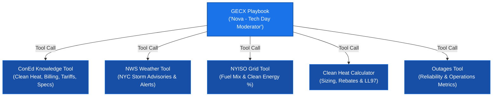

# Con Edison Tech Day 2026: AI in Action Keynote Moderator ("Nova")

An interactive, holographic 3D AI Moderator application designed for the **Con Edison Tech Day: "AI in Action at Con Edison"** keynote and panel showcase (October 7, 2026).

The AI moderator, **Nova**, is powered by Con Edison’s new **Gemini Enterprise Customer Experience (GECX)** platform—the same cutting-edge platform currently driving the employee Service Desk call center. Introduced by **Christian Mairhofer** (AI Solutions Lead for ETS), Nova guides the audience through the 40-minute keynote segment (11:00 – 11:40 AM) moderating four core enterprise business use cases before transitioning attendees to the Demo Booths in The Hub (Noon – 3:00 PM).

---

## 🚀 Key Features

1. **3D Photo-Realistic Avatar Stage**:
   - WebGL 3D avatar rendered via Three.js with studio 3-point lighting and electric blue rim illumination.
   - **Articulatory Phoneme-to-Viseme Lip-Sync**: G2P phonetic parsing maps spoken text into 12 Apple ARKit blendshape groups with real-time co-articulation interpolation and Web Audio RMS dynamic modulation (see [How the Phoneme-to-Viseme Lip Sync Engine Works](HOW_THE_PHONEME_TO_VISEME_LIP_SYNC_ENGINE_WORKS.md)).
   - Procedural life simulation: natural eye blinking cycles, gaze saccades, smiling baseline, emphasis eyebrow gestures, and rhythmic breathing motion.

2. **Dual-Mode Stage Presentation Architecture**:
   - **Keynote Stage Mode (Default)**: Full-stage visual layout optimized for large auditorium displays and LED video walls. Features sleek lower-third presenter cards, glowing active speaker HUD, AV slide standby animation, and zero chat window clutter.
   - **Demo Booth Mode**: Interactive conversational mode with full chat history, real-time tool telemetry inspector, and microphone input for deep dive technical exploration.
   - **Instant Toggle**: Switch seamlessly using the header `[🖥️ STAGE MODE]` / `[💬 BOOTH MODE]` button or the `[V]` hotkey.

3. **Google Cloud Text-to-Speech (Studio Voice)**:
   - Powered by Google Cloud's `en-US-Studio-O` high-fidelity Studio Voice model.
   - Professional, articulate, youthful, and cheerful tone (never uses slang) with a calibrated stage pacing rate (0.88x) and `headphone-class-device` audio DSP profile.
   - In-memory MD5 caching on the Express backend provides instantaneous (<25ms) speech playback.

4. **Exclusive GECX Playbook Intelligence**:
   - All conversations and stage Q&A route directly to **Google Enterprise Customer Experience (GECX)** / Dialogflow CX Playbooks (`projects/[project]/locations/us-central1/agents/668bd4db-b76d-4f1b-be6b-8e290bb741bd/playbooks/2b294c58-7cfb-4aa6-bc72-3a591ce18841`).
   - Grounded in playbook goals, instructions, session management, and extensible OpenAPI tools.
   - Header features a luminous GECX Playbook status badge with an active pulsing cyan LED.

5. **Con Edison Keynote Agenda & Business Use Cases**:
   - **`00 KICKOFF`**: Keynote Opening & Introduction (Nova introduced by Christian Mairhofer)
   - **`01 BILLING`**: Customer Billing Processes (Presenters: Marilyn Silva & Mario Noyola)
   - **`02 IDLING & STEAM`**: Vehicle Idling Fines and Steam Operations (Presenters: Christian Mairhofer, Alyssa Sotto, Joe McLain)
   - **`03 OUTAGES`**: Outage Management Processes (Presenters: Tom Langlois & Kevin Wasserman)
   - **`04 SPARK PLATFORM`**: Spark Platform Multi-Area AI (Presenters: Jayne Sosland & Mario Noyola)
   - **`05 WRAP-UP`**: Concluding Remarks, round of applause, transition to Demo Booths in The Hub (Noon – 3:00 PM), and stage handoff to Dina.

6. **Presenter Stage HUD & Hotkeys**:
   - **`Spacebar`**: Toggle Play / Pause speech.
   - **`→` (Right Arrow)**: Advance to next topic.
   - **`←` (Left Arrow)**: Return to previous topic.
   - **`0` – `5`**: Direct jump to specific keynote topic.
   - **`V`**: Toggle between Keynote Stage Mode and Demo Booth Mode.
   - **`M`**: Toggle live microphone for audience voice Q&A (Web Speech API).
   - **`?`**: Open the Nova Capabilities & System Guide overlay.
   - **URL Direct Hash**: Jump or bookmark any use case directly (e.g., `#billing`, `#idling`, `#outages`, `#spark`).

---

## 🏛️ Architecture: GECX Enterprise Integration

```
               ┌────────────────────────────────────────────────────────┐
               │          FRONTEND: 3D HOLOGRAPHIC AVATAR STAGE         │
               │  - Nova 3D WebGL / Three.js Engine                     │
               │  - Audio FFT Analyser -> ARKit Morph Viseme Lip-Sync   │
               │  - Stage Mode / Booth Mode View Toggle                 │
               │  - Lower-Third Presenter Card & AV Standby Overlay     │
               └───────────────────────────┬────────────────────────────┘
                                           │ Spoken / Text Input (Q&A)
                                           ▼
               ┌────────────────────────────────────────────────────────┐
               │               TIER 2: EXPRESS BACKEND (Cloud Run)      │
               │  - /api/agenda : 6 Keynote Topics, Presenters & Times  │
               │  - /api/tts    : Google Cloud TTS (en-US-Studio-O)     │
               │  - /api/chat   : GECX Dialogflow CX Sessions Router    │
               │  - /api/tools  : Native OpenAPI Tool Connectors        │
               └───────────────────────────┬────────────────────────────┘
                                           │
                                           │ [GECX Enterprise Routing]
                                           ▼
               ┌────────────────────────────────────────────────────────┐
               │                      GECX BACKEND                      │
               │            (Dialogflow CX / Vertex AI Agents)          │
               │  - Nova - Tech Day Moderator Playbook                  │
               │  - Session Management & Intent Resolution              │
               │  - OpenAPI 3.0 Real-Time System Tools                  │
               │  - Con Edison Official Knowledge Base Grounding        │
               └────────────────────────────────────────────────────────┘
```

---

## 🔍 How Knowledge Repositories & Tools Work in GECX

In GECX (Google Enterprise Customer Experience / Dialogflow CX), conversational agents ground their responses through **Playbook Tools**. Rather than querying public search indiscriminately, GECX Playbooks orchestrate specialized tool connectors based on the user's intent:


```mermaid
flowchart TD
    Playbook["GECX Playbook<br>('Nova - Tech Day Moderator')"]
    
    KnowledgeTool["ConEd Knowledge Tool<br>(Clean Heat, Billing, Tariffs, Specs)"]
    WeatherTool["NWS Weather Tool<br>(NYC Storm Advisories & Alerts)"]
    GridTool["NYISO Grid Tool<br>(Fuel Mix & Clean Energy %)"]
    CalcTool["Clean Heat Calculator<br>(Sizing, Rebates & LL97)"]
    OutageTool["Outages Tool<br>(Reliability & Operations Metrics)"]
    
    Playbook -->|"Tool Call"| KnowledgeTool
    Playbook -->|"Tool Call"| WeatherTool
    Playbook -->|"Tool Call"| GridTool
    Playbook -->|"Tool Call"| CalcTool
    Playbook -->|"Tool Call"| OutageTool

    classDef primary fill:#1a73e8,stroke:#1557b0,color:#ffffff,stroke-width:2px;
    classDef tool fill:#174ea6,stroke:#1a73e8,color:#ffffff;

    class Playbook primary;
    class KnowledgeTool,WeatherTool,GridTool,CalcTool,OutageTool tool;
```

### Connected Playbook Tools:

1. **`coned-knowledge-tool`**: Searches official Con Edison knowledge base for customer billing, clean heat heat-pump rebates, EV charging tariffs, outage management, and grid resilience.
2. **`nws-weather-tool`**: Fetches real-time National Weather Service severe weather alerts and storm advisories for New York City.
3. **`nyiso-grid-tool`**: Fetches real-time NYISO electric grid fuel mix, generation load, and zero-carbon clean energy percentage for NY.
4. **`clean-heat-calc-tool`**: Calculates heat pump sizing tonnage, Con Edison clean heat rebates, and Local Law 97 penalty avoidance for residential and commercial buildings.
5. **`outages-tool`**: Fetches real-time Con Edison outage statistics, customer restoration numbers, and 99.99% system reliability metrics.

---

## 📂 Repository Structure

```
├── avatar_stage.js          # Three.js 3D avatar engine, lighting, visemes & procedural life
├── stage_controller.js      # Keynote presentation controller, 6 topics, hotkeys & AV overlay
├── index.html               # Main holographic stage broadcast interface & Stage/Booth views
├── styles.css               # Stage HUD, lower-thirds, non-wrapping header lockup & animations
├── server.js                # Express backend with dual GECX Playbook and Gemini routing
├── gecx_service.js          # GECX SDK client, session path builder & payload parser
├── test/
│   ├── test_gecx.js         # GECX test suite (9 tests)
│   ├── test_visemes.js      # Phoneme-viseme lip-sync tests (9 tests)
│   └── test_hybrid.js       # Enterprise hybrid test suite (13 tests)
├── package.json             # Node.js dependencies (@google-cloud/dialogflow-cx, etc.)
├── Dockerfile               # Production container definition for Cloud Run
├── public/
│   ├── agenda.json          # Master keynote agenda, 4 use cases, presenters, talk tracks
│   └── assets/
│       ├── audio/           # Google Studio Voice pre-rendered MP3 audio (topic_0.mp3 - topic_5.mp3)
│       └── avatars/         # 3D avatar assets
└── scripts/
    ├── generate_agenda_audio.js # Google Cloud TTS Studio Voice generation script
    └── provision_gecx_tools.js  # Dialogflow CX Playbook and OpenAPI tool provisioning script
```

---

## 🛠️ Local Development & Running

### Prerequisites
- Node.js 18+
- Google Cloud authentication (`gcloud auth application-default login`)

### 1. Run with GECX Backend
```bash
npm install

# Optional environment overrides
export GCP_PROJECT_ID=""
export GECX_LOCATION="us-central1"
export GECX_AGENT_ID=""

npm start
# Server starts on http://localhost:8080 using server.js with GECX integration
```

### 2. Verify Connected GECX Agent Info
When running, you can inspect the connected agent metadata via:
```bash
curl http://localhost:8080/api/gecx/agent
```

---

## 🧪 Testing & Validation

The repository includes a comprehensive 3-part test suite validating GECX service initialization, canonical session path construction, live Dialogflow CX connectivity, articulatory viseme lip-sync mathematics, and hybrid real-time tools:

```bash
npm test
```

### Test Suite Coverage (31 Tests Total):
- **`test_gecx.js` (9 Tests)**: Service initialization, regional endpoints, session paths, input rejection, response sanitization, stage action payload parsing, live agent connectivity, and live topic query resolution.
- **`test_visemes.js` (9 Tests)**: ARKit viseme parsing, bilabial closures, rounded lip funnels, front spread vowels, co-articulation interpolation, zero mouth pucker enforcement, silent trailing vowel suppression, and continuous phonation.
- **`test_hybrid.js` (13 Tests)**: Real-time intent detection, deterministic heat pump & Local Law 97 calculation engine, live NWS/NYISO/outages telemetry connectors, and 1.5-second SLA timeout fallback protection.

---

## ☁️ Cloud Run Deployment

To deploy the service to Google Cloud Run:

```bash
gcloud run deploy coned-techday-nova \
  --source . \
  --region us-central1 \
  --allow-unauthenticated \
  --project {GCP_PROJECT_NAME} \
  --memory 1Gi \
  --cpu 1
```

Once deployed, the service provides an isolated, production-grade endpoint (`https://<service>-<hash>-<region>.a.run.app`).

---

## 📄 License
Internal Con Edison Demonstration — Enterprise AI & Technology Solutions (ETS).
