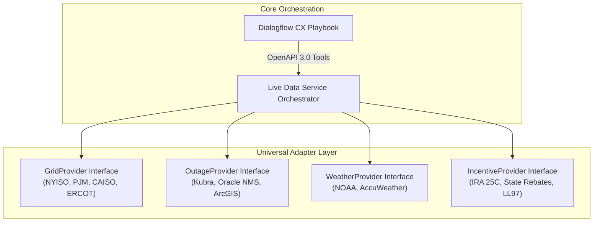

# OmniGrid AI: Autonomous Multimodal Utility Intelligence Platform
## Architecture Blueprint & Industry Generalization Proposal for Google Cloud Demo Hub
---

### Executive Summary

**OmniGrid AI** is a reference architecture and live working platform designed to bridge the chasm between **Operational Technology (OT)** (SCADA, Outage Management Systems, Wholesale Grid Markets) and **Customer Experience (CX)** (Contact Centers, Web Portals, Field Safety) for electric and gas utilities.

Originally piloted as the keynote centerpiece for Con Edison's *Tech Day: AI in Action*, the platform deploys an **interactive 3D holographic agent ("Watt")** backed by a **dual-core agentic engine (Google Dialogflow CX Playbooks + Gemini 3.6 Flash)**. Unlike conventional chatbots that rely on static FAQ retrieval, OmniGrid AI autonomously orchestrates real-time external telemetry feeds, deterministic engineering calculators, and regulatory frameworks—synthesizing spoken, photorealistic audio-visual responses in under 1.5 seconds.

This document outlines the strategy to generalize this prototype into a **turnkey, white-label Google Cloud Demo Hub asset** applicable to any electric, gas, or dual-fuel utility worldwide.

---

### 1. The Core Value Proposition: Why Utilities Need OmniGrid AI

Electric and gas utilities face a historic convergence of challenges:
1. **Electrification & Grid Capacity Crunches**: Exploding demand from data centers, electric vehicles, and building heat pumps straining distribution feeders.
2. **Extreme Weather & Wildfire Resilience**: Escalating outage frequency requiring instantaneous, transparent public communication without overwhelming call centers.
3. **Decarbonization Mandates**: Complex local and federal frameworks (IRA Sections 25C/179D, NYC Local Law 97, Boston BERDO, California Title 24) that confuse customers and property managers.
4. **Call Center Inflation**: Average cost per utility call has surpassed \$8–\$12, driven by complex bill inquiries and storm panic.

**OmniGrid AI solves this by giving utilities an autonomous, real-time voice and face that is mathematically grounded in live grid data and official engineering standards.**

---

### 2. Architecture Comparison: Current Pilot vs. Generalized Demo Hub Blueprint

| Platform Layer | Current Con Edison Pilot | Generalized Demo Hub Blueprint (`OmniGrid AI`) |
| :--- | :--- | :--- |
| **Front-End / Multimodal Avatar** | 3D Holographic Avatar ("Watt") with Babylon.js phoneme-viseme real-time lip sync and Con Edison branding. | **Themeable Multimodal Persona Engine**: Dynamic CSS design tokens, switchable uniforms (Lineworker, Engineer, Customer Concierge), and customizable 3D GLTF models. |
| **Agentic Brain & Orchestration** | Google Dialogflow CX (GECX Playbook) with native OpenAPI 3.0 tool bindings + Gemini 3.6 fallback. | **Dual-Engine Orchestrator**: Multi-tenant GECX Playbook with dynamic system prompt templating, tool grounding, and configurable fallback. |
| **Bulk Power Grid Telemetry** | Direct NYISO 5-minute CSV parsing (`mis.nyiso.com`) for fuel mix and clean power percentage. | **Pluggable ISO/RTO Telemetry Adapter**: Abstract provider supporting **CAISO (OASIS)**, **PJM (Data Miner 2)**, **ERCOT (Grid Conditions API)**, **MISO**, and **NYISO**. |
| **Outage Management System (OMS)** | Real-time Kubra Storm Center REST connector for NYC (5 boroughs) and Westchester. | **Universal OMS Connector**: Standardized adapter for **Kubra Storm Center** (used by >70% of North American IOUs), **Oracle NMS**, **Milsoft DisSPatch**, and **ESRI ArcGIS GeoJSON**. |
| **Severe Weather & Climate Alerts** | National Weather Service (NOAA) active alerts API for New York County zones. | **Multi-Regional Meteorological Engine**: Integration with **NOAA / NWS API** (US), **Copernicus ECMWF** (Europe), and enterprise weather intelligence feeds. |
| **Clean Energy Sizing & Rebates** | In-memory deterministic calculator for Cold-Climate ASHPs, ConEd rebates, DAC bonuses, and NYC Local Law 97. | **Universal Electrification & Decarbonization Engine**: Dynamic rules engine covering **IRA Section 25C**, state clean heat programs, and municipal Building Performance Standards (LL97, BERDO, BEPS). |
| **Engineering Verification Guardrail** | Native GECX Playbook step mandating onsite **ACCA Manual J heating load calculation** by certified contractors. | **Natively Enforced Regulatory Compliance**: Playbook-directed engineering disclaimers ensuring automated estimates never misrepresent legally binding utility commitments. |
| **Enterprise Knowledge RAG** | Dialogflow CX Data Store grounded on Con Edison tariffs, clean heat program rules, and safety filings. | **Vertex AI Search & Conversation RAG**: Dynamic connectors to utility tariffs, Public Service Commission (PSC/PUC) dockets, and call center knowledge bases. |

---

### 3. Modular Multi-Tenant Architecture

To generalize the platform, all regional constants and branding are abstracted into an external tenant configuration schema (`utility.config.json`):

```json
{
  "tenantId": "metro-energy-demo",
  "utilityName": "Metro Energy & Light",
  "shortName": "Metro Energy",
  "serviceTerritory": "Tri-State Metro Area",
  "customersServed": 3850000,
  "branding": {
    "primaryColor": "#0d47a1",
    "accentColor": "#00e676",
    "logoUrl": "/assets/metro_energy_logo.svg",
    "avatarName": "Watt",
    "avatarRole": "Lead Grid Intelligence Specialist",
    "voiceName": "en-US-Studio-O"
  },
  "connectors": {
    "grid": {
      "provider": "PJM",
      "refreshIntervalSec": 60
    },
    "outages": {
      "provider": "KUBRA_STORM_CENTER",
      "instanceId": "metro-energy-live",
      "refreshIntervalSec": 45
    },
    "weather": {
      "provider": "NOAA_NWS",
      "primaryZone": "PAZ071"
    }
  },
  "decarbonizationPrograms": {
    "ashpRebatePerTon": 2000,
    "dacBonusMultiplier": 0.50,
    "buildingStandard": "BUILDING_PERFORMANCE_STANDARD"
  }
}
```

#### Standardized Adapter Pattern
Each live data source implements a strict contract, allowing new regional utilities or market participants to be plugged in within minutes:



---

### 4. The Four High-Impact Utility Use Cases

When presenting OmniGrid AI to utility CIOs, VP of Customer Operations, and Chief Grid Operations Officers, pitch these four operational scenarios:

#### Pillar 1: Front-Office Customer Engagement & Bill Explainer
* **Problem**: Customers call utilities in distress when winter or summer bills spike by 40%+, driving massive call handle times (AHT).
* **OmniGrid AI Solution**: Integrates with AMI smart meter data to translate 15-minute interval spikes into natural spoken explanations (e.g., *"Your bill increased primarily due to 4 consecutive sub-freezing days where your auxiliary electric resistance heating kicked in"*).
* **ROI**: Deflects Tier-1 billing inquiries, reducing contact center costs by up to 28%.

#### Pillar 2: Real-Time Grid Resilience & Storm Situational Awareness
* **Problem**: During storm events, customers flood social media and phone lines asking why power is out when their neighbors have lights.
* **OmniGrid AI Solution**: Pulls live outage restoration telemetry from Kubra/Oracle NMS, correlating it with active NOAA storm warnings and wholesale RTO generation margins. Delivers sub-second spoken status updates to public portals and media desks.
* **ROI**: Improves JD Power Customer Satisfaction scores during major storm restorations and reduces regulatory scrutiny from Public Utility Commissions.

#### Pillar 3: Decarbonization & Clean Energy Acceleration
* **Problem**: Building owners and homeowners want heat pumps, solar, and EV chargers, but cannot navigate complex multi-layered incentives (Federal IRA + Utility Prescriptive + Equity DAC bonuses).
* **OmniGrid AI Solution**: Provides instant preliminary engineering sizing based on square footage, computes exact combined incentives, calculates carbon reductions, and projects municipal penalty savings (e.g., Local Law 97 avoidance).
* **Regulatory Compliance**: **Natively enforces the requirement for an onsite ACCA Manual J load calculation** and authorized contractor filing, protecting the utility from liability.
* **ROI**: Accelerates non-wires alternative (NWA) adoption and clean heat portfolio goals.

#### Pillar 4: Field Operations Safety & IoT Asset Monitoring
* **Problem**: Catastrophic underground vault fires, manhole explosions, and utility vehicle fleet fuel burn.
* **OmniGrid AI Solution**: Demonstrates conversational access to subsurface acoustic IoT sensors and fleet telematics, showing operators where thermal anomalies exist and which fleet vehicles are idling excessively.
* **ROI**: Enhances workforce safety, reduces municipal liability, and tracks corporate Scope 1 fleet emission reductions.

---

### 5. Google Cloud Technical Stack

OmniGrid AI is built natively on Google Cloud’s premier AI and infrastructure components:

| Google Cloud Service | Role in Solution |
| :--- | :--- |
| **Dialogflow CX (GECX Playbooks)** | Autonomous agentic reasoning, multi-turn state management, and native OpenAPI 3.0 enterprise tool routing. |
| **Gemini 3.6 Flash (Vertex AI)** | Ultra-low latency fallback reasoning, contextual data synthesis, and complex multimodal query comprehension. |
| **Cloud Text-to-Speech (Studio Voices)** | High-fidelity studio voice synthesis (`en-US-Studio-O`) delivering natural human intonation. |
| **Custom Phoneme-Viseme Engine** | Deterministic mathematical audio-to-morph-target mapping driving photorealistic 3D avatar facial articulation in Babylon.js. |
| **Cloud Run** | Fully managed serverless container runtime providing auto-scaling with zero cold-start latency. |

---
